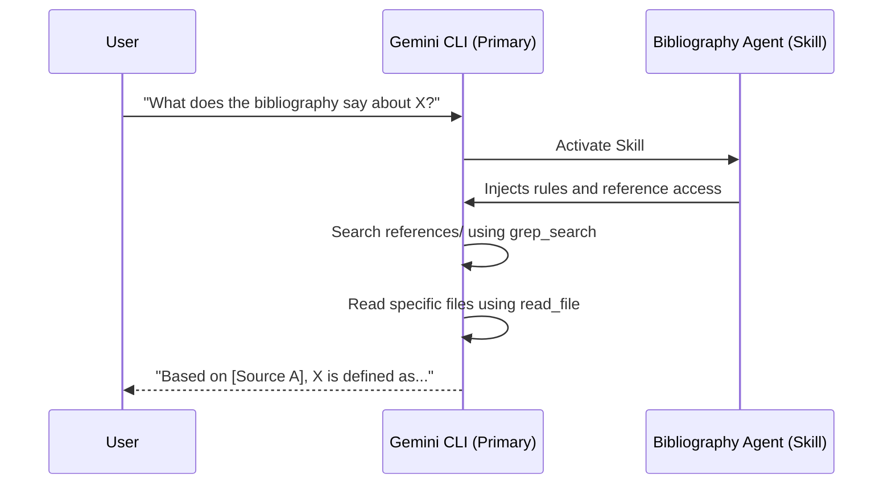

# Creating Bibliography-Based Agents

Creating an agent grounded in a specific bibliography or a set of reference documents in Gemini CLI involves defining a **Skill** or using **`GEMINI.md`** imports. This allows the agent to access and "search" your specific data set during a conversation.

## Creation Methods

### 1. Creating a Research Skill (Recommended for Large Datasets)
A **Skill** is the most effective way to bundle a bibliography. It organizes your expertise and documents into a single directory.

*   **Structure:**
    ```text
    ~/.gemini/skills/my-bibliography-agent/
    ├── SKILL.md            # Rules and instructions for the agent
    └── references/         # Folder containing your bibliography (PDFs, Markdown, Text)
        ├── paper1.pdf
        ├── data.json
        └── summary.md
    ```
*   **The `SKILL.md` File:** This file defines the agent's behavior. It should include instructions like:
    - "You are a research assistant specializing in [Topic]."
    - "Use the files in the `references/` directory to answer questions."
    - "Always cite your sources from the provided bibliography."
*   **How it works:** When you ask a question related to your bibliography, the primary agent activates this skill. It then uses its internal tools (`grep_search`, `read_file`) to retrieve information from the `references/` folder.

### 2. Using `GEMINI.md` (For Project-Wide Context)
If your bibliography is smaller or specific to a single project, you can use the **Import Syntax** in a `GEMINI.md` file.

*   **Syntax:** `@path/to/my_bibliography.txt`
*   **Result:** The contents of the file are automatically injected into the agent's context window whenever you are working in that project.

---

## How to Interact with the Agent

You **do not need to write a custom client** for your bibliography agent. You interact with it directly within the standard Gemini CLI interface.

### 1. Automatic Activation
If you have defined a Skill with a clear description (e.g., "An expert on the history of 20th-century architecture"), the primary agent will automatically "activate" that skill when it detects your query matches that expertise.

### 2. Manual Activation
You can explicitly tell the CLI to use a specific skill:
- `activate_skill(name="my-bibliography-agent")`
- Or simply: "Use my research skill to analyze this document."

### 3. Interaction Flow



### Summary of the Interaction Model
- **Unified Interface:** You stay in the same terminal session.
- **Delegated Expertise:** The primary agent acts as a "coordinator," calling upon the specialized bibliography agent (skill or subagent) when needed.
- **Tool-Based Retrieval:** Instead of a static database, the agent dynamically searches and reads your files just as a human researcher would.
