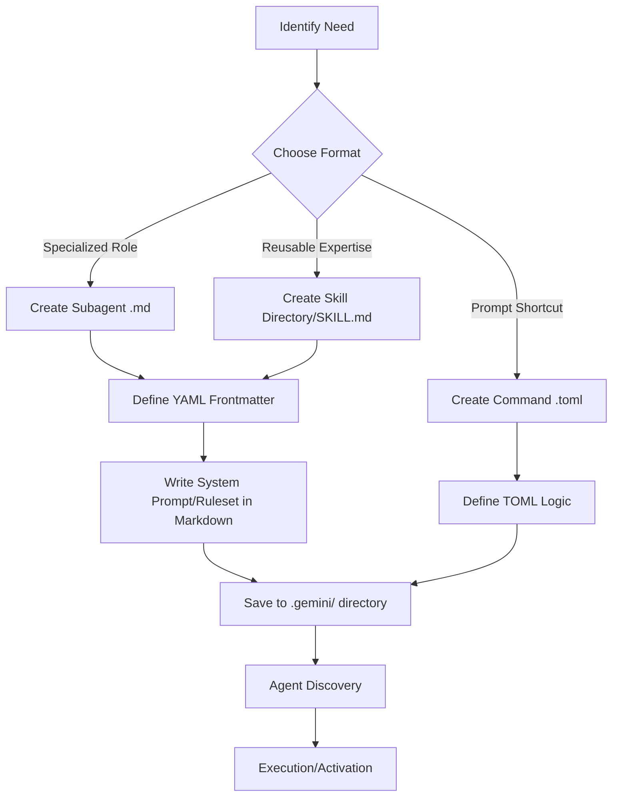

# Creating Agents and Skills in Gemini CLI

Gemini CLI allows for the creation of specialized "Subagents" and "Skills" to extend its capabilities. These are defined using structured text files, typically in Markdown format with YAML frontmatter.

## Agent Types and Definitions

| Feature | Subagents | Agent Skills | Custom Commands |
| :--- | :--- | :--- | :--- |
| **Primary Use** | Specialized experts with unique system prompts and toolsets. | On-demand expertise or procedural guidance activated by the main agent. | Reusable prompt shortcuts for common tasks. |
| **Format** | `.md` files with YAML frontmatter. | `SKILL.md` file within a dedicated directory. | `.toml` files. |
| **Storage Location** | `.gemini/agents/` or `~/.gemini/agents/` | `.gemini/skills/` or `~/.gemini/skills/` | `.gemini/commands/` or `~/.gemini/commands/` |
| **Configuration** | `name`, `description`, `model`, `tools`, `max_turns`. | `name`, `description`, `version`. | `args`, `env`, `description`. |

## The Creation Process

The following diagram illustrates the lifecycle of creating and using a custom agent or skill.

### Step-by-Step Guide

1.  **Identify the Requirement:** Determine if you need a persistent specialized persona (Subagent), a set of instructions for specific tasks (Skill), or a simple shortcut (Command).
2.  **Initialize the Structure:**
    *   For **Subagents**, create a new `.md` file in your agents directory.
    *   For **Skills**, it is recommended to use the built-in creator: `create a new skill called 'my-skill'`.
3.  **Configure Metadata (YAML/TOML):**
    *   Define the `name` and `description`. The description is critical as it tells the primary agent *when* to invoke this specific expert.
    *   Specify `tools` if the agent needs access to specific capabilities (e.g., shell access, file reading).
4.  **Define the Ruleset:**
    *   Write a clear, concise system prompt in the Markdown body. This acts as the "brain" of your agent.
    *   Include constraints, style preferences, and specific procedures.
5.  **Validation:**
    *   Restart or refresh the CLI context to ensure the new agent is discovered.
    *   Test the agent by providing a prompt that triggers its specific description.
