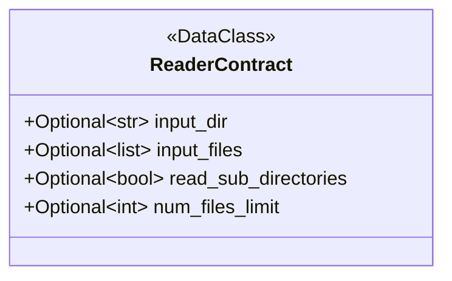
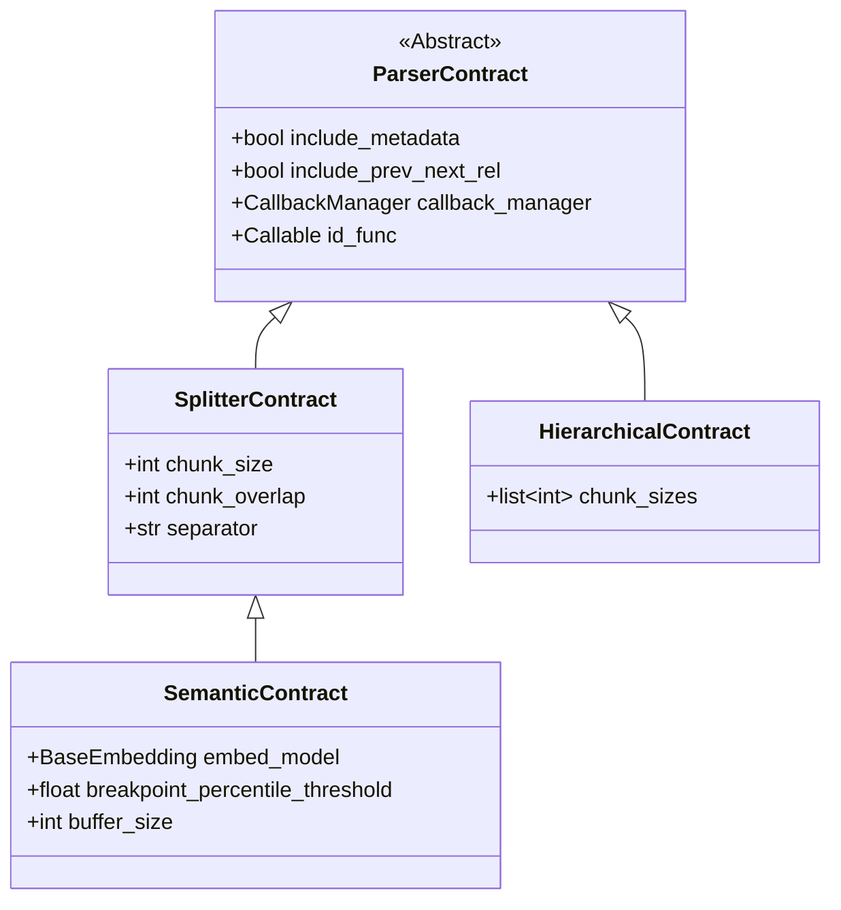

# Prototype for Ingestion Pipeline

## Step 0: Requirements and Dependencies

### 0.1 LlamaIndex

```bash
# Core and common integrations
pip install llama-index-core
pip install llama-index-readers-file
pip install llama-index-embeddings-google
pip install llama-index-vector-stores-chroma
```

## Step 1: Load Raw Documents

```py
reader = SimpleDirectoryReader(ReaderContract)
reader.load_data()

# Can iterate over files as they load
acc = []
for docs in reader.iter_data():
    ...


```




TODO: Need to capture metadata to later select correct Parser in Chunk Loaded Content

## Step 2: Chunk Loaded Content

LlamaIndex has multiple methods depending on the content type. This MUST be determined before deploying the correct parser!

[LllamaIntex Parsers](https://developers.llamaindex.ai/python/framework/module_guides/loading/node_parsers/modules/)

### 2.1 Common Args
* `include_metadata` [Global/Instance] - Whether to include document metadata in the resulting nodes.
* `include_prev_next_rel` [Global/Instance] - Whether to include relationships between sequential nodes (linking a node to its predecessor and successor)
* `callback_manager` [Global] - Used for tracing and logging events durring process

### 2.2 Text-Based Common Args
* `chunk_size` [Global] - The maximum size of each chunk (measured in tokens or characters depending on the parser).
* `chunk_overlap` [Global] - The amount of text to repeat between consecutive chunks to maintain context.
* `separator` [Instance] - (delimiter) The character or string used to identify where splits can occur (common in TokenTextSplitter and SentenceSplitter).
* `embed_model` [Global] - represents the specific software engine that takes human-readable text and turns it into a list of numbers (a vector)
* `breakpoint_percentile_threshold` & `buffer_size` [Instance] - Highly specific to the "Semantic" logic



### 2.3 Universal Contract

```py
@dataclass
class UniversalParserContract(ParserContract):
    # Standard splitting fields
    chunk_size: Optional[int] = 1024
    chunk_overlap: int = 20
    
    # Advanced fields
    embed_model: Optional[BaseEmbedding] = None
    
    # The "Catch-All" for edge cases (tags, language, window_size)
    extra_params: dict[str, Any] = field(default_factory=dict)

    def build_parser(self):
        # Example for HTML
        if self.parser_type == "html":
            return HTMLNodeParser(
                tags=self.extra_params.get("tags", ["p", "h1"]),
                **self.base_params # helper to get include_metadata, etc.
            )
```

### 2.4 Missing Arguments and Edge Cases

**Base Layer (ParserContract):**

* id_func: A common but often overlooked argument. It allows you to pass a custom function to generate Node IDs (crucial for maintaining consistency across ETL runs).

**Structural Layer (HTML/Code):**

* tags: Specific to HTMLNodeParser. Without this, you can't control which elements are extracted.

* language: Required for CodeSplitter.

* max_chars: Often used in code and file parsers instead of (or alongside) token-based chunking.

**Advanced Splitting Layer (Semantic/Window):**

* chunk_sizes (List): The HierarchicalNodeParser requires a list of integers, not a single chunk_size.

* window_size: Required for the SentenceWindowNodeParser.

* breakpoint_percentile_threshold: Critical for tuning the SemanticSplitterNodeParser.