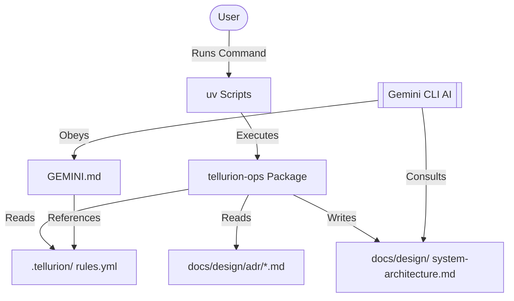

# Design: Governance Structure

This document clarifies the roles and boundaries between the four layers of the Tellurion Governance Ecosystem.

## 1. Governance Comparison Matrix

| Component | Responsibility | Role | State |
| :--- | :--- | :--- | :--- |
| **`.tellurion/`** | **The Law** | Static source of truth (YAML). | Immutable State |
| **`GEMINI.md`** | **The Enforcer** | AI-specific behavioral directive. | Behavioral Logic |
| **`tellurion-ops`**| **The Lawyer** | Internal package for automation/sync. | Execution Logic |
| **`uv Scripts`** | **The Clerk** | User interface (CLI commands). | Command Entry |

## 2. Organizational Structure

## 3. Scopes & Boundaries

### `.tellurion/` (The Law)
- **Scope**: Project-wide configuration, architectural constraints, and operational mode definitions.
- **Responsibility**: Providing a machine-readable foundation for all other layers.

### `GEMINI.md` (The Enforcer)
- **Scope**: AI behavioral constraints only.
- **Responsibility**: Bridging the gap between the YAML "Law" and the AI's "Executive" actions.

### `tellurion-ops` (The Lawyer)
- **Scope**: Internal automation scripts, document generation, and health checks.
- **Responsibility**: Performing the "manual labor" of project maintenance. It should **never** contain business logic for the Tellurion Framework itself.

### `uv Scripts` (The Clerk)
- **Scope**: Command-line entry points.
- **Responsibility**: Simplifying complex `tellurion-ops` calls into memorable commands (e.g., `uv run sync`).
