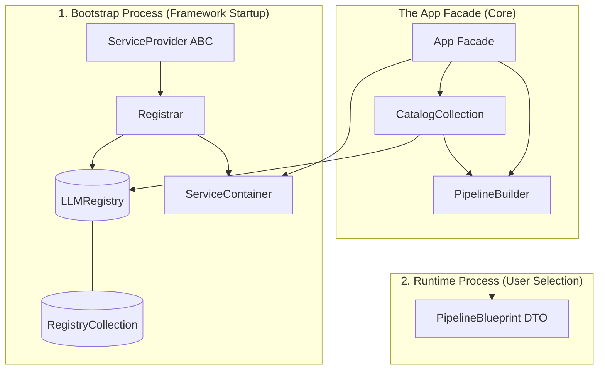

# x.1 Component Registry and Catalog

**Conceptual Logic Flow**:
1. **Bootstrap** - Registrar fills Registry with every LLM tool
2. **Selection** - `app.pipeline.build().addLLM()` Builder checks Catalog if `llm` exists
3. **Assembly** - `.addLLM()` a `ParserBlueprint` copied from `Registry` by `Registrar` into `PipelineBlueprint`
4. **Execution** - `Fascade.Executor.run(blueprint)` Executes

**Read and Write Heirarchies**:


## x.2 Project Directory Tree (Ingestion-Pipeline)

The following structure represents the isolated Ingestion-Pipeline sub-system, focusing on the Registry-Catalog pattern and Blueprint-driven orchestration.

```text
src/
├── app/
│   └── pipeline.py             # IngestionPipeline (The Facade/Entry Point)
├── core/
│   ├── registries/             # INTERNAL STATE ("The Vaults")
│   │   ├── base.py             # Abstract BaseRegistry[T] (add/get/list)
│   │   ├── collection.py       # RegistryCollection (Container for all Vaults)
│   │   ├── embeddings.py       # EmbedRegistry
│   │   ├── llms.py             # LLMRegistry
│   │   ├── parsers.py          # ParserRegistry
│   │   └── readers.py          # ReaderRegistry
│   ├── ports/
│   │   ├── input/              # WRITE INTERFACE
│   │   │   └── registrar.py    # Registrar (Validates & populates Registries)
│   │   └── output/             # READ INTERFACE
│   │       └── catalog/        # "The Lenses" (Read-only views)
│   │           ├── base.py     # Abstract BaseCatalog[T] (names/get_info)
│   │           ├── collection.py # CatalogCollection (The "Menu")
│   │           ├── llms.py     # LLMCatalog
│   │           ├── parsers.py  # ParserCatalog
│   │           └── ...         # Specific Catalog implementations
│   └── services/               # LOGIC & ORCHESTRATION
│       ├── builder.py          # PipelineBuilder (DSL with "Sticky Defaults")
│       └── executor.py         # PipelineExecutor (Runs the Blueprint)
├── domain/
│   └── models/
│       └── blueprints/         # DATA TRANSFER OBJECTS (The "Stitch")
│           ├── pipeline.py     # PipelineBlueprint (The Master DTO)
│           ├── llm.py          # LLMBlueprint
│           ├── embed.py        # EmbedModelBlueprint
│           ├── source.py       # SourceBlueprint / SourceEntry
│           ├── parser.py       # ParserBlueprint
│           └── storage.py      # StorageBlueprint
└── infrastructure/
    ├── bootstrap.py            # Bootstrap (Initializes & populates Registries)
    └── container.py            # ServiceContainer (Dependency resolution)
```