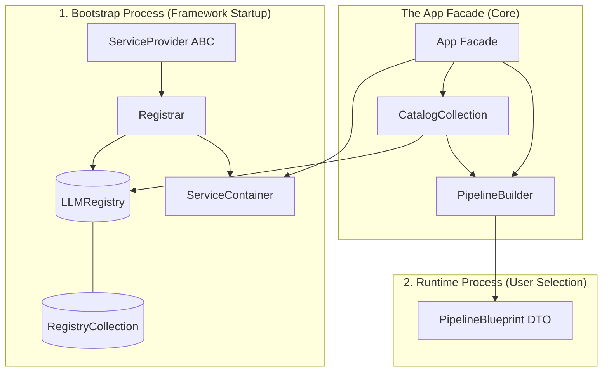

# x.1 Component Registry and Catalog

**Conceptual Logic Flow**:
1. **Bootstrap** - Registrar fills Registry with every LLM tool
2. **Selection** - `app.pipeline.build().addLLM()` Builder checks Catalog if `llm` exists
3. **Assembly** - `.addLLM()` a `ParserBlueprint` copied from `Registry` by `Registrar` into `PipelineBlueprint`
4. **Execution** - `Fascade.Executor.run(blueprint)` Executes

**Read and Write Heirarchies**:
