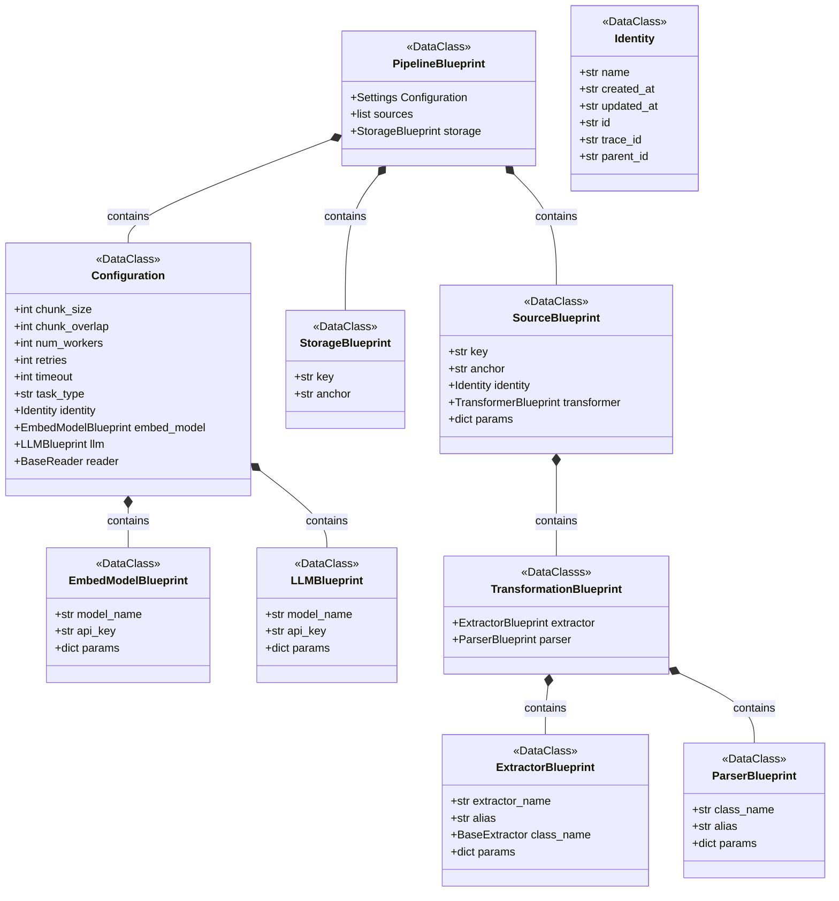

# Ingestion Pipeline Blueprints / Data Transfer Objects

```mermaid

classDiagram
    class PipelineBlueprint {
        <<DataClass>>
        +Settings Configuration
        +list sources
        +StorageBlueprint storage
    }

    class Configuration {
        <<DataClass>>
        +int chunk_size
        +int chunk_overlap
        +int num_workers
        +int retries
        +int timeout
        +str task_type
        +Identity identity
        +EmbedModelBlueprint embed_model
        +LLMBlueprint llm
        +BaseReader reader
    }

    class EmbedModelBlueprint {
        <<DataClass>>
        +str model_name
        +str api_key
        +dict params
    }

    class LLMBlueprint {
        <<DataClass>>
        +str model_name
        +str api_key
        +dict params
    }

    class StorageBlueprint {
        <<DataClass>>
        +str key
        +str anchor
    }

    class SourceBlueprint {
        <<DataClass>>
        +str key
        +str anchor
        +Identity identity
        +TransformerBlueprint transformer
        +dict params
    }

    class ParserBlueprint {
        <<DataClass>>
        +str class_name
        +str alias
        +dict params
    }

    class ExtractorBlueprint {
        <<DataClass>>
        +str extractor_name
        +str alias
        +BaseExtractor class_name
        +dict params
    }

    class TransformationBlueprint {
        <<DataClasss>>
        +ExtractorBlueprint extractor
        +ParserBlueprint parser
    }
    
    class Identity {
        <<DataClass>>
        +str name
        +str created_at
        +str updated_at
        +str id
        +str trace_id
        +str parent_id
    }
    %% Relationships
    PipelineBlueprint *-- Configuration : contains
    PipelineBlueprint *-- SourceBlueprint: contains
    PipelineBlueprint *-- StorageBlueprint : contains

    SourceBlueprint *-- TransformationBlueprint : contains

    TransformationBlueprint *-- ExtractorBlueprint : contains
    TransformationBlueprint *-- ParserBlueprint : contains
    
    Configuration *-- EmbedModelBlueprint : contains
    Configuration *-- LLMBlueprint : contains
```
