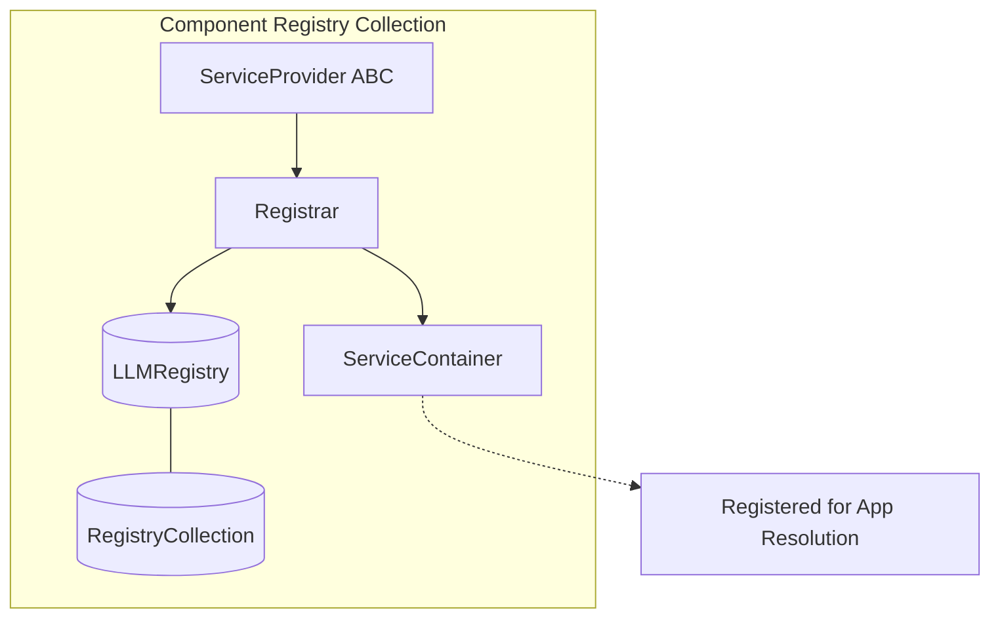

# Ingestion Pipeline Bootrap

## 1.0 `Bootstrap()`

**Class Properties**
* **`ServiceProvider(ABC)`** - 
* **`ServiceContainer`** - See below

**Notes**:

* Implement *Late Binding* approach where Service-Providers registers the *Potential* to create an object but only instantiates it if the user doesn't provide an override

```py
# Inside your Bootstrap / ServiceProvider
def register_defaults(container):
    # Registering a "Factory" or "Provider", not an instance
    container.register("READER:LOCAL", lambda: SimpleDirectoryReader())
    container.register("PARSER:SENTENCE", lambda: SentenceSplitter(chunk_size=1024))

    # TODO: Figure out how Bootstrapped settings like chunk_size=1024 above are added via a similar mechanism to the later Blueprints which will be utilized for communication between various pipeline.addX() methods
```

**Methods**
* **`register()`** - 
* **`boot()`** - 

#### 2.1.2.x `Registrar()`

```py
    # In App/fascade class
    @property
    def register(self):
        return self._registrar

class Registrar:
    def __init__(self, registries: RegistryCollection):
        self.llms = registries.get("llms") # Returns registry of llms
```

