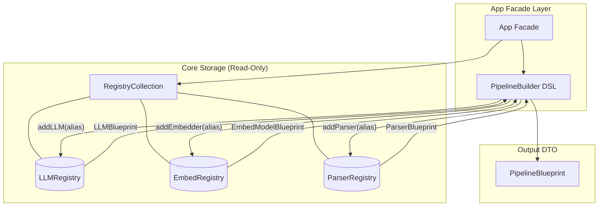
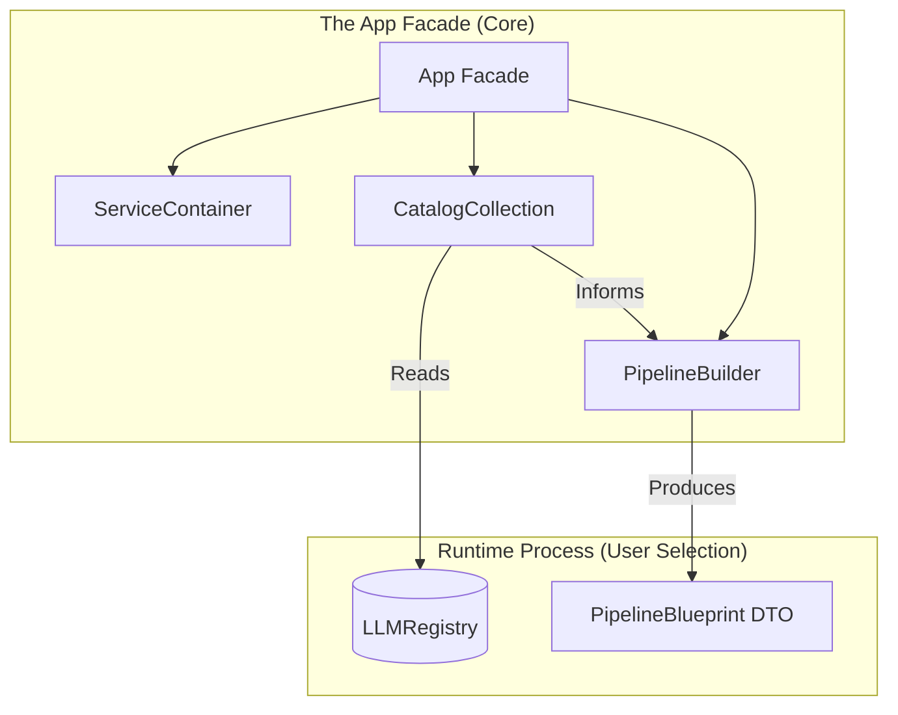

# Ingestion Pipeline Domain-Library Gateway

## 1. Overview

* **Domain Library**: Standalone packages unaware parent 'App' exists

`pipeline = IngestionPipeline()` - Gateway for Ingestion Pipeline Domain Library

---

### 1.1 LlamaIndex Linear Progression

1. Configure - Assigns BaseEmbedding with `Settings.embed_mode = OpenAIEmbedding()` 
2. Assign Reader Instance `reader = SimpleDirectoryReader()`
3. Read Content - `documents = reader.load_data()`
4. Parse - `nodes = get_nodes_from_documents(documents)`
5. Enrich / Extract Metadata - `TitleExtractor()`, `SummaryExtractor()`, etc.
6. Embed - Vectorize Nodes `get_text_embedding()`
7. Index - Build the Search Index `VectorStoreIndex(...)`
8. Persist - Save to Disk/DB `index.storage_context.persist()`

---

### 1.2 Pipeline Progression

#### 1.2.1 Fascade Initialization

1. Call the fascade/entry-point
2. Initialize

```py
from src.app import IngestionPipeline
pipeline = IngestionPipeline()
```

#### 1.2.2 Build Process

1. Check available resources:

```py
pipeline.available.parsers # Returns list of available Parsers
pipeline.available.embedders # Returns list of available Embedders
```

2. Call Builder and assign properties:

```py
# Calling builder DSL
pipeline.build() \
    .addParser("sentance_splitter") \
    .addLLM("google_flash", api_key="asd33d-sfhsdhfjhwp323s") \
    .addEmbedder("google", model_name="model/gemini-embedding-2-preview") \
    .addReader("some-reader") \
    .addSource("path/to/dir") \
    .addSource("path/to/other/dir")
```

3. Builder assembles blueprints and final `PipelineBlueprint` DTO



## 2.1 Dependencies

**Initialized Properties**
* **`self._container`** [ServiceContainer] - Main Service Container
* **`self._catalogs`** [CatalogCollection] - Represents the interface with the Catalogs

**@Properties**
* **`available`** - Facilitates access to `CatalogCollection`
* **`build`** - Returns new `Builder(self._catalog)` instance

### 2.1.1 Catalog Collection

* **Property**: `self._catalogs`
* **Fascade**: `available`

**Conceptual Logic Flow**:
1. **Selection** - `app.pipeline.build().addLLM()` Builder checks Catalog if `llm` exists
2. **Assembly** - `.addLLM()` uses `Catalog` to search `Registry` for `llm` param and produces properties to generate `LLMBlueprint`



**Implementation**

```py
    # In App/Facade class
    def __init__(self, service_container:ServiceContainer, **kwargs):
        self._container = service_container
        self._catalogs = CatalogCollection(
            collection=self.container.get(RegistryCollection)
        )

    @property
    def available(self):
        # Returns a small helper that points to the registries
        # Returned Catalog is readonly
        return self._catalogs

    @property
    def build(self):
        # Returns new builder instance
        return Builder(self._catalogs)

# CatalogCollection handles the namespaces
class CatalogCollection:
    def __init__(self, catalogs: CatalogCollection):
        # Composition: It holds the specific catalogs
        self.llms = catalogs.get("llm")
        self.embeddings = catalogs.get("embeddings")
```

## Appendix A

### A.1 TODO:

**Gemini API Usage Metrics**
1. See if the Gemini embedding and model return those metrics after a run
2. Itentify API properties: requests, errors, tokens_used, input_tokens, embed_tokens, etc.