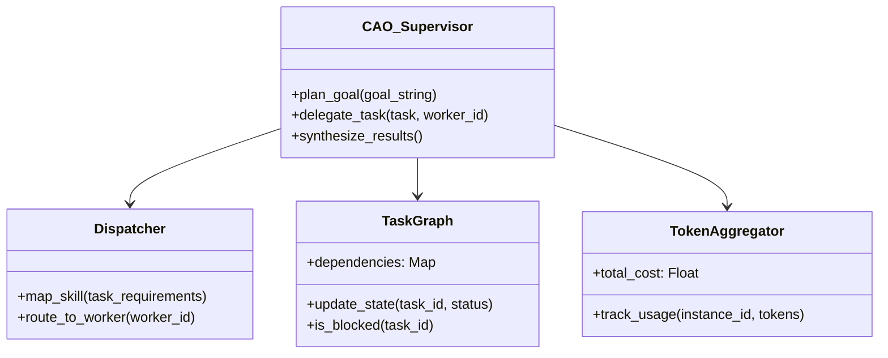
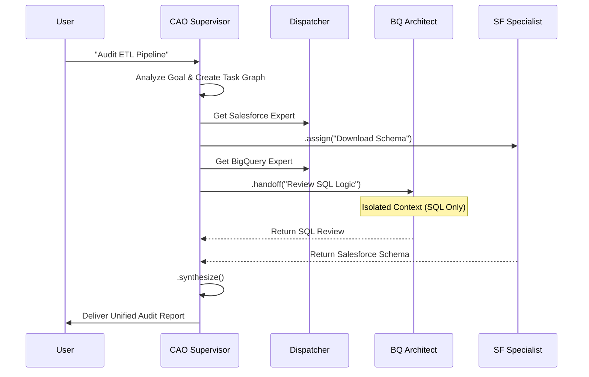

# Design Prototype: Client Agent Orchestrator (CAO)

The **Client Agent Orchestrator (CAO)**—pronounced "kay-oh"—acts as the "General Manager" of the AI department. While the **Instance-Based Manager** handles the technical plumbing (process spawning, tmux management), the CAO governs the high-level logic, inter-agent communication, and strategic planning.

---

## 1. Hierarchical Orchestration Model

CAO follows a **Hub-and-Spoke** model to prevent the "too many cooks" problem, ensuring that expert agents work as a cohesive unit under a single supervisor.

- **The Supervisor (The Hub):** A high-reasoning agent (typically Gemini 1.5 Pro) that receives high-level goals. It performs the planning and delegation rather than the direct implementation.
- **The Workers (The Spokes):** Specialized Gemini CLI instances (e.g., "BigQuery Architect") running in isolated environments.
- **The Dispatcher:** An internal routing engine that maps supervisor requests to the appropriate worker based on the available skills in the `./.gemini/skills/` directory.

---

## 2. System Architecture & Directory Tree

CAO utilizes session-based isolation via Linux terminal multiplexing to maintain clean context windows for every expert.

### 2.1 Directory Structure
```text
project-root/
├── .gemini/
│   ├── cao/
│   │   ├── fleet.json          # Real-time status of all active worker instances
│   │   ├── task_graph.json     # Dependency map for the current high-level goal
│   │   └── inboxes/            # Communication buffers between agent processes
│   │       ├── supervisor/     # Central command inbox
│   │       ├── bq-worker/      # BigQuery Architect inbox
│   │       └── sf-worker/      # Salesforce Specialist inbox
│   └── skills/                 # Static Expert Agent definitions
└── cao_engine/
    ├── supervisor.py           # Strategic planning and delegation logic
    ├── dispatcher.py           # Task routing and skill mapping
    └── aggregator.py           # Synthesis of multi-agent outputs
```

### 2.2 The "Inbox" System
Each agent is assigned a local directory-based "Inbox." CAO acts as a secure mail carrier, moving data and instructions between these directories to facilitate inter-agent collaboration without polluting individual context windows.

---

## 3. Logic & Component Diagrams

### 3.1 Class Diagram


---

## 4. Fleet Properties & Orchestration Methods

### 4.1 Fleet State Properties
| Property | Purpose |
| :--- | :--- |
| **`active_fleet`** | A dynamic list of all running Gemini CLI instances and their associated PIDs. |
| **`task_graph`** | A visual map of inter-agent dependencies (e.g., "Architect is waiting for Specialist output"). |
| **`token_aggregator`** | A real-time counter tracking total token expenditure across the entire session. |
| **`consensus_flag`** | A boolean state used for **Evaluation (LLM-as-a-Judge)** steps requiring multi-agent agreement. |

### 4.2 Orchestration Methods
- **`.handoff(task, worker_id)`**: **Synchronous.** The Supervisor assigns a task and pauses until the expert returns a result.
- **`.assign(task, worker_id)`**: **Asynchronous.** The Supervisor assigns a task (e.g., "Download Salesforce Schema") and continues planning other sub-tasks.
- **`.broadcast(message)`**: Sends a global update to all active agents (e.g., "Database target has changed to prod_v2").
- **`.synthesize()`**: Collects outputs from all workers and merges them into a single, unified report for the user.

---

## 5. Process Flows

### 5.1 Multi-Agent Task Flow


---

## 6. Governance: The "Project Lead" Authority

CAO possesses **Orchestrational Authority** over the entire AI department.

1.  **Resource Allocation:** Decisions on model routing—allocating **Gemini Pro** for complex reasoning (Supervisor) and **Gemini Flash** for repetitive tasks (Workers).
2.  **Conflict Resolution:** Triggers **LLM-as-a-Judge** loops to break ties if experts disagree on technical implementations.
3.  **Privacy Guardrails:** Automatically redacts sensitive PII or API keys from inter-agent communication buffers to ensure security compliance.

### The Control Tower
For the human orchestrator, CAO provides a "Control Tower" (Web UI or TUI) to monitor `tmux` sessions side-by-side, track the real-time "token burn," and manually intervene if a specific worker process requires steering.
