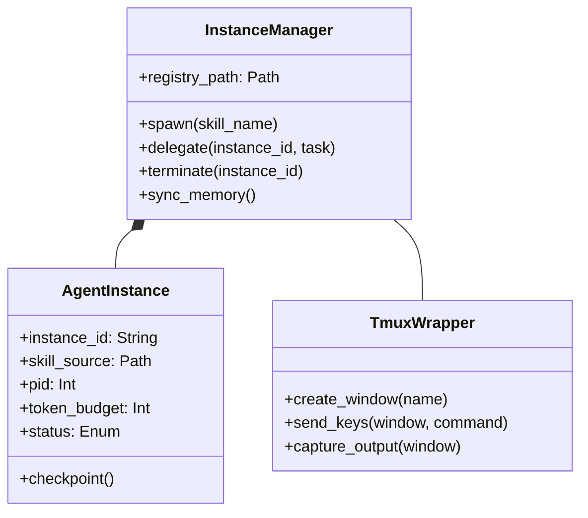
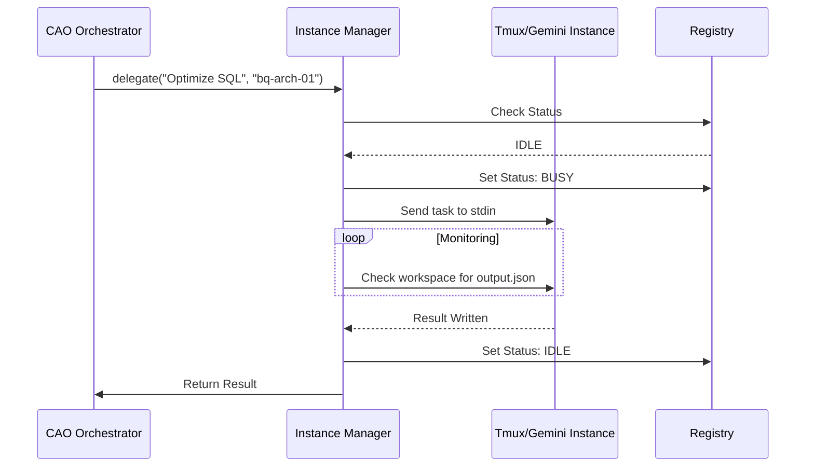

# Design Prototype: Instance-Based Manager

The **Instance-Based Manager** serves as the "Virtual Office Manager" for Tellurion. Operating as a robust orchestration layer between the **Skill Factory** (static definitions) and the **CAO** (high-level logic), it manages the complete lifecycle of individual expert processes in a Linux environment.

---

## 1. System Architecture

The Manager employs a **Registry-Worker** pattern, treating each "Expert" as a standalone Linux process isolated within its own workspace to prevent file-system collisions and context noise.

### 1.1 Directory Structure
```text
project-root/
├── .gemini/
│   ├── instances/              # Active agent workspaces
│   │   ├── bq-arch-01/         # Isolated temp files & logs
│   │   └── sf-spec-01/         # Isolated temp files & logs
│   ├── skills/                 # Static skill definitions (from Factory)
│   ├── registry/
│   │   └── instances.json      # Runtime state of active agents
│   └── memory/                 # Global persistence layer
└── manager/
    ├── core.py                 # Main orchestration logic
    ├── tmux_wrapper.py         # Multiplexer interface
    └── lock_manager.py         # File-system conflict resolution
```

### 1.2 The Registry Pattern
The `instances.json` file tracks the live state of the ecosystem:
```json
{
  "active_instances": [
    {
      "instance_id": "bq-arch-01",
      "skill": "bigquery-architect",
      "pid": 12345,
      "tmux_session": "gemini_main",
      "status": "BUSY",
      "token_usage": 4500
    }
  ]
}
```

---

## 2. Component Logic & Class Diagram

The Manager is built as a Python-based wrapper utilizing `tmux` for background process persistence.

### 2.1 Class Diagram


---

## 3. Operational Logic: Methods & Properties

### 3.1 Instance Properties
| Property | Purpose |
| :--- | :--- |
| **`Instance_ID`** | A unique UUID or slug (e.g., `bq-arch-01`) to distinguish it from other active experts. |
| **`Skill_Source`** | The absolute path to the `.gemini/skills/` folder defined by the Skill Factory. |
| **`PID`** | The Linux Process ID, allowing the Manager to perform health checks and resource termination. |
| **`Token_Budget`** | A "Hard Cap" on token expenditure to prevent runaway costs or loops. |
| **`Status`** | Current state: `IDLE`, `BUSY`, `CRASHED`, or `SUMMARIZING`. |

### 3.2 Core Methods
- **`.spawn(skill_name)`**: Creates a new `tmux` window, executes `gemini --skill <name>`, and updates the registry.
- **`.delegate(task_string)`**: Pipes a task to the instance’s `stdin` and monitors the isolated workspace for completion.
- **`.checkpoint()`**: Programmatically triggers the `/compress` command to preserve context signal while freeing tokens.
- **`.terminate()`**: Gracefully kills the CLI process and exports the session log to the **LLM-as-a-Judge** layer.
- **`.sync_memory()`**: Flushes local "Struggles" and "Mastered Topics" to the **Global Persistence Layer**.

---

## 4. Process Flows

### 4.1 Delegation User-Flow


---

## 5. Scope, Authority, and Conflict Resolution

The Manager is the **"King of the Directory"** for a local project.

1.  **Resource Authority:** Controls CPU/RAM allocation (potentially via Linux `cgroups`) for each Gemini process.
2.  **Communication (The Mailman):** Acts as the secure courier between experts. It picks up the output of the BigQuery Expert and delivers it to the Supervisor or Salesforce Specialist.
3.  **Conflict Resolution (File Locking):** If two instances attempt to modify the same ETL script, the Manager implements a **File Lock** pattern, queuing the agents to prevent race conditions.

---

## 6. Strategic Benefit: The "Pristine Environment"

By utilizing an Instance-Based Manager, the system ensures that every technical implementation (e.g., writing a complex BigQuery schema) is performed in a **pristine environment**. The agent's head is not "noisy" with irrelevant Salesforce data or previous session history; it sees only the current task and its specialized reference library, drastically reducing the risk of cross-domain hallucinations.
