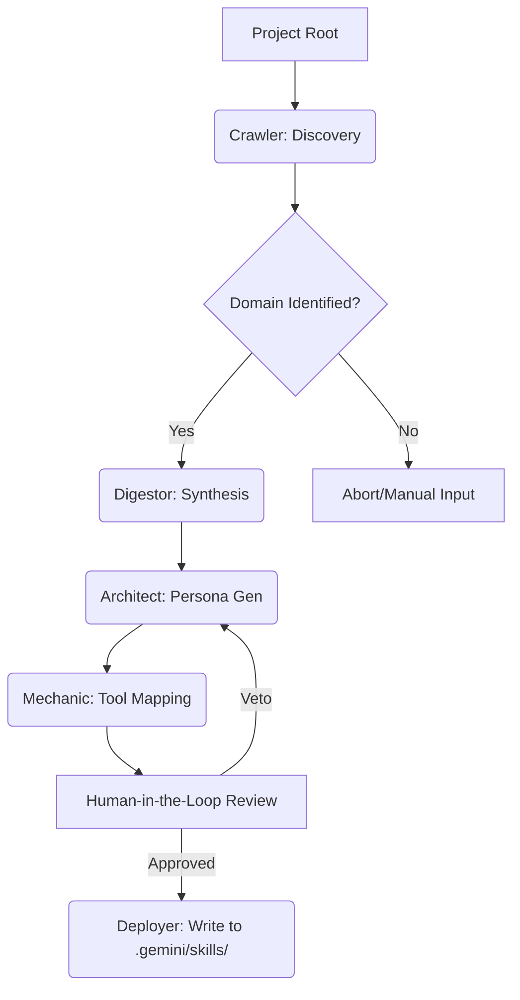
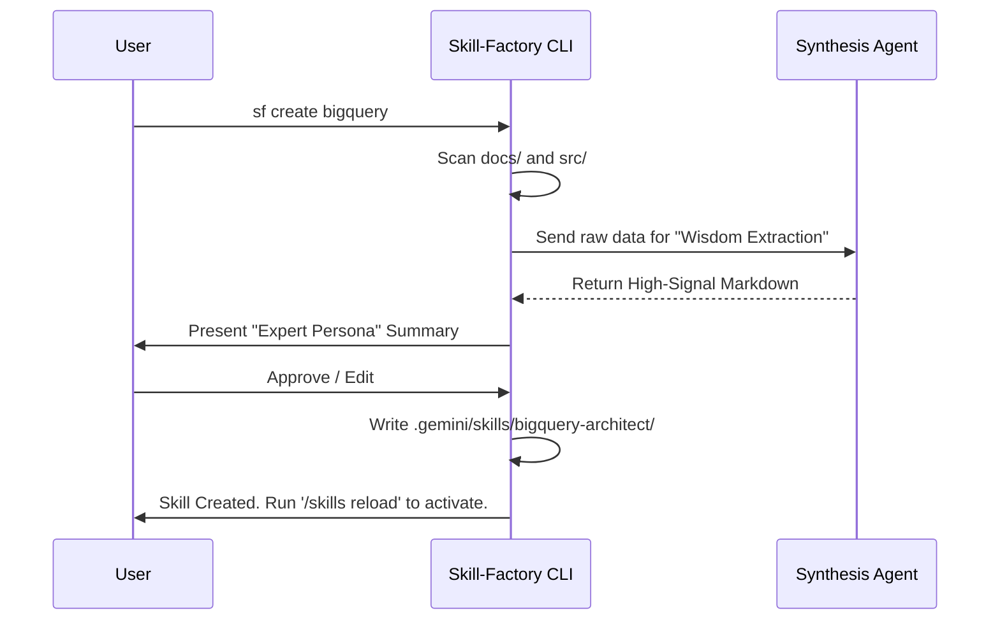
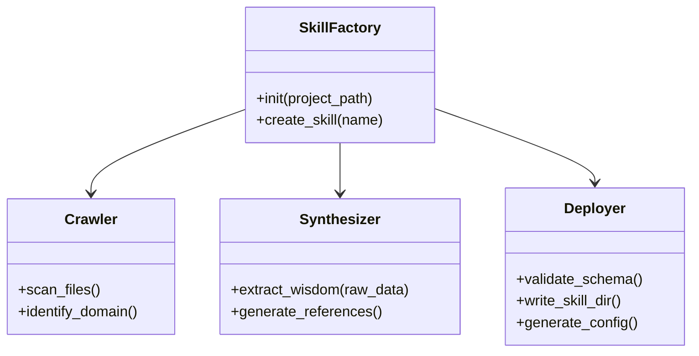

# Design Prototype: Skill Factory Automation Workflow

The **Skill Factory** is a framework designed to automate the creation of "Expert Agents" (Skills) for the Gemini CLI. It acts as a bridge between raw project artifacts (code, documentation, configs) and the structured `./.gemini/skills/` architecture, ensuring that every expert is high-signal, token-efficient, and logically consistent.

---

## 1. Universal Automation Workflow (ETL Pattern)

The framework follows a standard **Extract, Transform, Load (ETL)** pattern, where the final "Load" target is the project's local skill directory.

### Step 1: Discovery (The "Crawler")
- **Input:** Project Root Path.
- **Process:** Recursive scan of the filesystem for `docs/`, configuration files (`package.json`, `requirements.txt`), and source code.
- **Goal:** Identify the project's "Domain" (e.g., "This is a Python/BigQuery ETL project").

### Step 2: Synthesis (The "Digestor")
- **Input:** Raw scraped data and manuals.
- **Process:** Utilizes a synthesis engine (e.g., **Fabric**) to extract key entities, API signatures, and architectural rules.
- **Goal:** Create high-density, low-token Markdown files for the expert's `references/` folder.

### Step 3: Persona Generation (The "Architect")
- **Input:** Synthesized Domain information.
- **Process:** Generates the `SKILL.md` file using a standardized template, including "Anchor" instructions, behavioral constraints, and core identity.
- **Goal:** Define the expert's specific "Mental Model."

### Step 4: Tooling Assignment (The "Mechanic")
- **Input:** Technical domain requirements.
- **Process:** Maps local scripts and MCP servers to the expert.
- **Goal:** Populate the `scripts/` folder with relevant "Hands" (tools) for the expert.

---

## 2. Visual Architecture

### 2.1 Logic Flowchart


### 2.2 User Interaction Flow


### 2.3 Framework Class Structure


---

## 3. Gemini CLI Specific Implementation

The framework respects the unique conventions of the Gemini CLI to ensure seamless "discovery" and activation.

- **Directory Targeting:** Targets `./.gemini/skills/<skill_name>/` exclusively.
- **Metadata Headers:** Injects the required **YAML frontmatter** into `SKILL.md`:
  ```yaml
  ---
  name: bigquery-architect
  description: Senior Data Engineer specializing in BigQuery optimization.
  version: 1.0.0
  ---
  ```
- **Skill-Creator Integration:** Optionally "describes" the project to the built-in `skill-creator` meta-skill to handle boilerplate generation.
- **Config Overrides:** Automatically generates `config.json` with precision-focused defaults:
  - `model`: `gemini-1.5-pro` (for complex reasoning).
  - `temperature`: `0.1` (for factual accuracy).

---

## 4. Tool Integration Strategy

| Component | Tool | Role |
| :--- | :--- | :--- |
| **Synthesis** | **Fabric** | Runs the `extract_wisdom` pattern to generate reference materials. |
| **Cleaning** | **Unstructured.io** | Strips noise from PDFs/HTML manuals before synthesis. |
| **Scaffolding** | **Cookiecutter** | Enforces standardized templates for `SKILL.md` and `config.json`. |
| **Validation** | **RAGAS / DeepEval** | Performs "Unit Tests" on the new expert to verify factual accuracy. |

---

## 5. Framework Geography (Project Structure)

If implemented as a Python project, the "Skill Factory" would follow this structure:

```text
skill-factory/
├── templates/          # Cookiecutter templates for SKILL.md and config.json
├── patterns/           # Fabric-style prompts for "Expert Synthesis"
├── core/
│   ├── crawler.py      # Scans the project root for artifacts
│   ├── synthesizer.py  # Orchestrates LLM digestion of docs
│   └── deployer.py     # Writes validated files to .gemini/skills/
└── main.py             # CLI entry point (e.g., 'sf create <name>')
```

---

## 6. Governance: The Human-in-the-Loop

The most critical component of the framework is the **Confirmation Step**. Before any files are written to the `.gemini/` directory, the framework presents a **Summary of Expertise**. As the Orchestrator, the user must manually approve or veto the proposed persona and toolset, ensuring the automated "Factory" remains aligned with the project's strategic goals.
